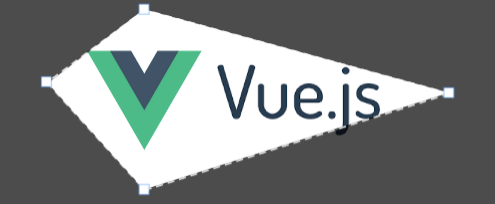

<div align="center">
  
  <h1>vue-polygon-cropper</h1>
</div>

<div align="center">
  <h2><a href="https://stackblitz.com/edit/vitejs-vite-urtqie?file=src%2FApp.vue">⚡Try on StackBlitz!</a></h2>
</div>

> [!WARNING]
> This component is still in development and only a early version with basic features have been released. Any recommendation, feature propose or bug report feel free to open an Issue or PR 😊

## Introduction

vue-polygon-cropper is a **Vue 3** component built-in in top of `fabric.js` to crop an image in polygon shapes.


## Installation

```shell
npm i @tato30/vue-polygon-cropper
```
```shell
yarn add @tato30/vue-polygon-cropper
```

## Basic Usage

```vue
<script setup lang="ts">
import { ref } from 'vue';
import { VuePolygonCropper } from '@tato30/vue-polygon-cropper'
</script>

<template>
  <vue-polygon-cropper src="https://domain/images/image1.jpg" :width="500" />
</template>
```

## Props

### src

Type: `string` <br />
Required: `true`

The URL to create an image from.

```vue
<vue-polygon-cropper src="https://domain/images/image1.jpg" />
```

### width

Type: `number` <br />
Required: `false`

The width to scale the image on the canvas element, otherwise the canvas will render with the image dimensions.

<vue-polygon-cropper src="https://domain/images/image1.jpg" :width="500" />

### height

Type: `number` <br />
Required: `false`

The height to scale the image on the canvas element, otherwise the canvas will render with the image dimensions.

This prop has less precedence than `width`.

<vue-polygon-cropper src="https://domain/images/image1.jpg" :height="700" />

### no-background

Type: `boolean` <br />
Default: `false` <br />
Required: `false`

Remove the background shape.

<vue-polygon-cropper src="https://domain/images/image1.jpg" no-background />

### background-color

Type: `string` <br />
Default: `rgba(0, 0, 0, 0.7)` <br />
Required: `false`

Set the background color.

<vue-polygon-cropper src="https://domain/images/image1.jpg" background-color="#FF5733FA" />

### points

Type: `array` <br />
Required: `false`

An array of cartesian points to shape an initial polygon on the image, the points must be calculated in base of the image's dimensions and can be set `1` or `n` points.

By default, the component creates four points for each corner of the image.

```vue
<vue-polygon-cropper
  src="https://domain/images/image1.jpg" 
  :points="[
    { x: 149, y: 1626 },
    { x: 1321, y: 1248 },
    { x: 1437, y: 41 },
    { x: 132, y: 212 },
    { x: 723, y: 920 },
    { x: 1202, y: 928 }
  ]"
/>
```

### lines

Type: `object | Line` <br />
Required: `false`

Specify the style of the lines drawn between points.

Default (All properties are optional):

```json
{
  "color": "white", // Line color
  "width": 1.5, // Line width in px
  "dash": [7, 5] // Dash array [dash, space], use [0, 0] for a thin line, in px
}
```

```vue
<vue-polygon-cropper
  src="https://domain/images/image1.jpg" 
  :lines="{
    width: 1,
    dash: [0, 0] 
  }"
/>
```


### handlers

Type: `object | Handler` <br />
Required: `false`

Specify the style of the handlers drawn by each point.

Default (All properties are optional):

```json
{
  "type": "rect", // Shape: "circle" or "rect"
  "color": "white", // Shape's fill color
  "borderColor": "#78a6f1", // Shape's border color
  "borderWidth": 0.5, // Shape's border width in px
  "padding": 10, // Padding of the movable area of the handler in px
  "width": 10, // Width of the 'rect' handler in px
  "height": 10, // Height of the 'rect' handler in px
  "radius": 5, // Radius of the 'circle' handler in px
}
```

```vue
<vue-polygon-cropper
  src="https://domain/images/image1.jpg" 
  :handlers="{
    borderWidth: 1,
    padding: 15,
    width: 7,
    height: 7,
  }"
/>
```

## Events

### loaded

Emitted once the image has been loaded.

```vue
<vue-polygon-cropper src="https://domain/images/image1.jpg" @loaded="onLoaded" />
```

### moving

Emitted when a point has been moved.

```vue
<vue-polygon-cropper src="https://domain/images/image1.jpg" @loaded="onMoving" />
```

The payload value contains the coordinates of all points in the canvas and scaled to image's dimensions

Example:

```json
{
  // Coordinates based on canvas
  "canvas": [ 
    {
      x: 120,
      y: 52
    },
    {
      x: 620,
      y: 80
    },
    {
      x: 690,
      y: 240
    },
    {
      x: 90,
      y: 300
    }
  ],
  // Coordinates scaled in base image's dimensions (scale: 2, in this example)
  "image": { 
    {
      x: 240,
      y: 104
    },
    {
      x: 1240,
      y: 160
    },
    {
      x: 1380,
      y: 480
    },
    {
      x: 180,
      y: 600
    }
  }
}

```